<div align="center">



<br/>

[](https://vanakka.com)
[](https://x.com/Vanakka)
[](mailto:Dev@Vanakka.com)
[](https://discord.com)

</div>

<div align="center">


</div>

## 🚀 // projekts.db · indexed

|     | project | status | what it is |
| :-: | :------ | :----: | :--------- |
| 🔴 | **proxmox homelab** | `always on` | Custom Proxmox server on ZFS — Debian containers, AMP game servers, media stack, Cloudflare Zero Trust tunnels |
| 🟠 | **anime/manga tracker** | `active dev` | Local-first Electron library + Chrome extension progress sync · SQLite · AniList/Jikan/MangaUpdates enrichment · 209 tests |
| 🟢 | **game modding tools** | `shipped` | Creation tooling for HOI4, Stellaris & Software Inc — batch generators for grand-strategy modding |
| 🟣 | **budget secure** | `active dev` | Offline Flutter finance app (Windows + Android) · SQLCipher + biometric unlock · zero cloud, zero analytics |
| 🔵 | **lorekeeper 40k** | `shipped` | Gemma 4 E4B fine-tune that narrates as a weary 40K witness — QLoRA, 500 hand-written examples, TTS-clean GGUF builds |
| ⭐ | **starmap foundry** | `ongoing` | Local 3D galaxy editor — Tauri 2 + Babylon.js 9 + Rust Keplerian math, binary/trinary systems, Holman-Wiegert stability |

> 🖥️ All of it lives at **[vanakka.com](https://vanakka.com)** — diagonal tabs, a live packet mesh, and a terminal that occasionally crashes the whole site on purpose. Try `vanakka.com/#crash`.

## 📊 // telemetry

<div align="center">

<a href="https://vanakka.com"></a>
<a href="https://toc.vanakka.com"></a>


</div>

```console
root@vanakka:~$ lab-monitor --status
● zpool nvme            ONLINE · scrub repaired 0B · 0 errors
● services              47/47 running
● cloudflare tunnels    2 active · 0 open ports
● projekts indexed      6 (2 shipped · 3 active dev · 1 ongoing)
● test suites           209 passing (tracker) · rust + playwright (starmap)
● local ml              gemma-4-e4b fine-tune · q8_0 + q4_k_m gguf
● cloud dependencies    0
root@vanakka:~$ _
```

<div align="center">


</div>

## 💻 // stack.manifest

<div align="center">


<br/>


<br/>


</div>

## 🏠 // homelab.rack

| node | runs | why |
| :--- | :--- | :--- |
| **Proxmox VE** | the whole show | hypervisor + ZFS pool, scrub-clean |
| **Debian CTs** | game servers · media · bots | AMP-managed dedicated servers, self-hosted media stack |
| **Cloudflare Tunnels** | secure ingress | zero open ports, Zero Trust access |
| **Local ML box** | llama.cpp · fine-tunes | GGUF quants, agent pipelines, no cloud inference |

---

<div align="center">

```text
> Awaiting tab selection_
```

<sub>profile auto-generated? no. hand-tuned like everything else here. · last human update: 2026-07</sub>

</div>
